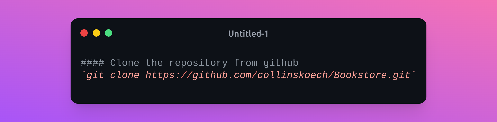
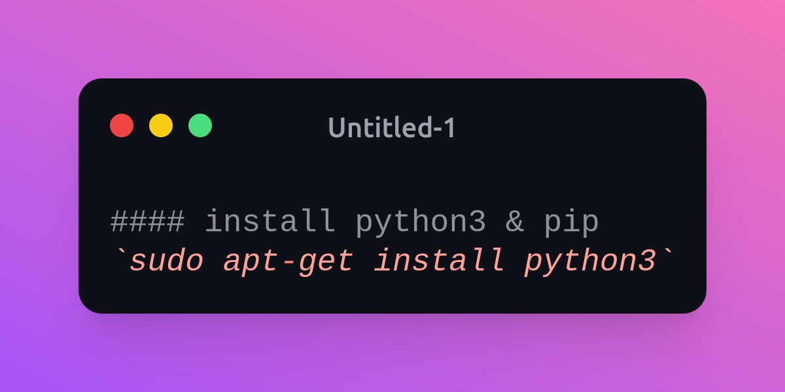
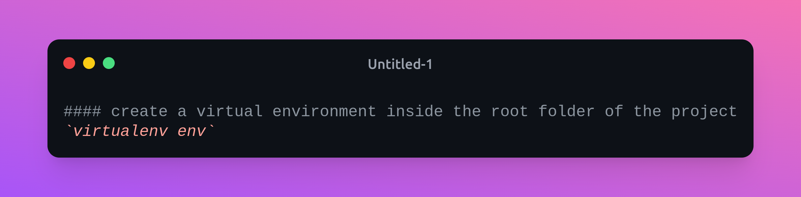
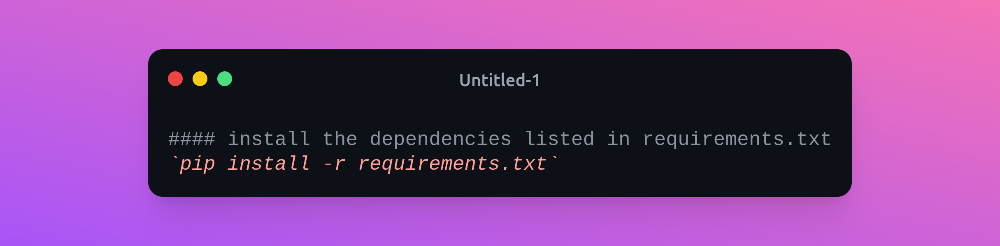
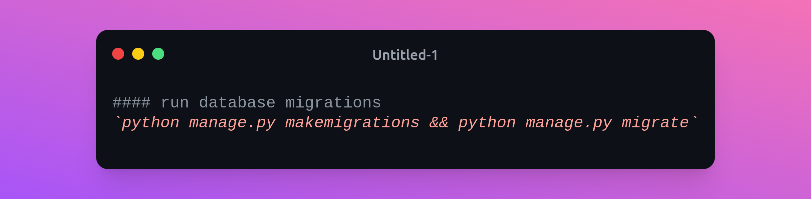
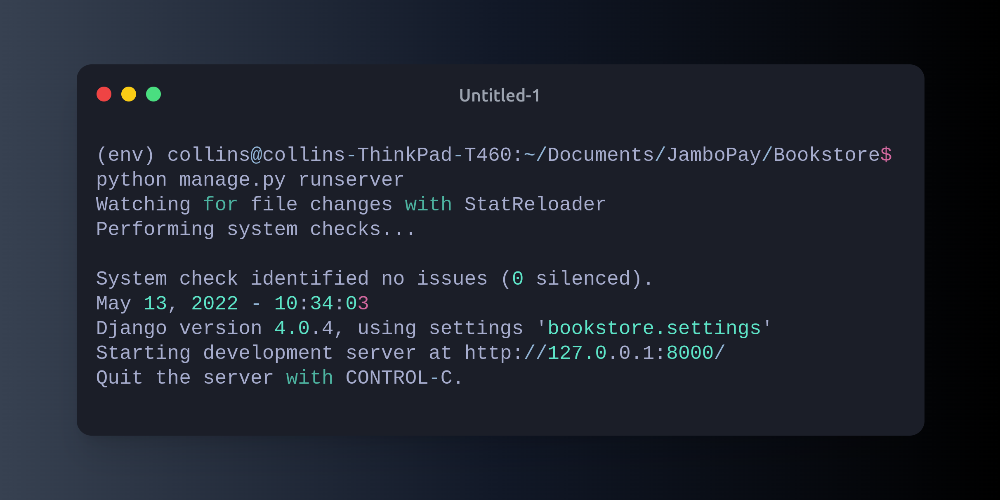
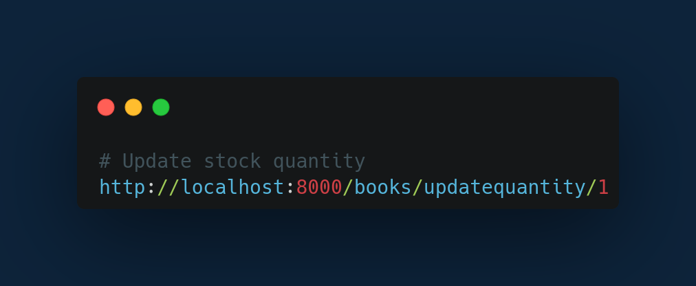

# Bookstore

## Database design 

### Book Table
| Field name | Data Type | 
| :-- | :-- | 
| [title] | [CharField(200)] | 
| [Author] | [ForeignKey(AuthorId)] | 
| [year] | [IntegerField] | 
| [description] | [CharField(200)] | 
| [quantity] | [IntegerField] | 

### Author Table
| Field name | Data Type | 
| :-- | :-- | 
| [fname] | [CharField(200)] | 
| [lname] | [CharKey(AuthorId)] | 
| [email] | [CharField] | 
| [Date_of_birth] | [DateField] | 

## How to run the Bookstore server 

## How to access the endpoints

run the sever

### endpoints

get all books

create a new book

get book with specific id

edit book with specific id

get books from a specific author

get books published in a specific year

get all authors

get author with specific id

add a new author

EditAuthor

Update stock quantity

